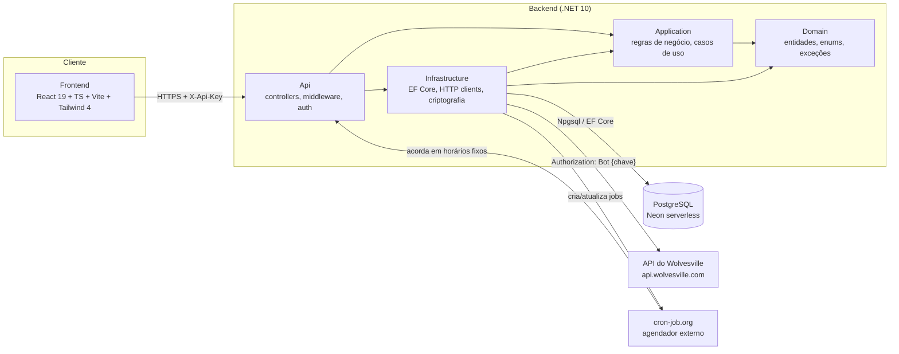

# Wolvesville Manager

Painel web para administrar um clã do jogo [Wolvesville](https://wolvesville.com) sem precisar
ficar o dia inteiro dentro do app do jogo. Um back-end em .NET fala com a API oficial de bot de
clã do Wolvesville em nome do usuário, e um front-end em React oferece uma tela única para tudo
que a liderança do clã faz no dia a dia: iniciar missões, gerenciar membros, conversar pelo chat,
acompanhar XP e rodar um formulário público de votação — além de agendar automações que fazem
tudo isso sozinhas, em horários definidos, sem ninguém precisar estar com o site aberto.

É um projeto pessoal, criado para administrar um clã real (o "Hogwarts", com tema de Harry Potter
refletido até na skin do próprio painel) em conjunto com quem também lidera o clã.

## O problema que ele resolve

Administrar um clã ativo no Wolvesville manualmente significa: abrir o app várias vezes por dia
só para ver se surgiu missão nova, decidir qual missão iniciar comparando o clima do grupo,
lembrar de dar boas-vindas a quem entra, ficar de olho em quem parou de participar das missões,
e correr para iniciar a missão certa antes que a janela de decisão feche — tudo isso enquanto o
site do painel poderia estar completamente fechado a maior parte do tempo.

O Wolvesville Manager resolve isso de duas formas:

1. **Um painel único** para todas as ações administrativas do clã (missões, membros, chat,
   anúncios, atividade, conteúdo do jogo), com a votação da comunidade sobre qual a próxima
   missão desejada centralizada num link público que qualquer pessoa do clã pode abrir sem login.
2. **Automações que rodam sozinhas.** Como a hospedagem é gratuita e o site "dorme" a maior
   parte do tempo (ver [Arquitetura de agendamento](#arquitetura-de-agendamento-a-parte-mais-distinta-do-projeto)
   abaixo), um serviço de cron externo acorda o site exatamente nos horários configurados para
   iniciar a missão mais votada, pular o tempo de espera, mandar boas-vindas para quem entrou, e
   por aí vai — sem que ninguém precise lembrar de fazer nada manualmente.

## Principais recursos

### Missões
- Visão geral das missões disponíveis no momento (com votos do próprio jogo), da missão ativa
  (progresso de XP do tier atual, prazo, participantes) e do histórico de missões concluídas.
- Ações de um clique: iniciar missão, embaralhar as ofertas, pular o tempo de espera, resgatar
  tempo extra e cancelar a missão ativa — todas confirmadas antes de gastar ouro/gemas do clã.

### Membros
- Lista ordenada por liderança e depois por XP contribuído, com nível, status de presença
  (online/jogando/offline), participação em missões (individual ou em massa), flair, kick e
  bloqueio/desbloqueio.
- **Relatório de XP por período**: como a API do jogo só expõe XP acumulado, o app tira uma foto
  diária do XP de cada membro e usa isso para calcular quanto cada um ganhou entre duas datas
  (padrão: últimos 7 dias, limite de 31 dias por consulta).

### Votação pública (o formulário sem login)
- A aba Votação gera um link (`/votar/{token}`) para compartilhar fora do app — Discord,
  WhatsApp, mural do próprio jogo. Quem abre vota digitando só o nick do Wolvesville; o voto é
  identificado **por nick** (não por navegador/dispositivo), então trocar de navegador não abre
  voto extra, e votar de novo com o mesmo nick simplesmente troca a escolha.
- A opção **"🔀 Embaralhar missões"** concorre como mais uma cédula na mesma urna — se vencer, uma
  automação embaralha as ofertas em vez de iniciar uma missão.
- Cada missão (e o embaralhar) tem um interruptor de visibilidade: dá pra tirar uma missão do
  formulário público sem perder a configuração, porque a escolha é amarrada à identidade estável
  da missão (derivada da imagem promocional), e não ao id da oferta, que rotaciona a cada troca de
  catálogo.
- Dois modos de prazo, mutuamente exclusivos: **prazo fixo** (6h/12h/24h/3 dias/7 dias a partir de
  agora — nunca "para sempre") ou **ciclos semanais recorrentes** (quantas janelas o admin quiser,
  ex.: "domingo 23h → segunda 11h" e "quarta 20h → quinta 11h"), com a votação abrindo e fechando
  sozinha toda semana.
- Uma automação do tipo "Iniciar mais votada do formulário" aplica o resultado no horário
  combinado — com ciclos configurados, ela apura só o **último ciclo já encerrado**, não a urna
  inteira (que pode já ter votos do próximo ciclo se a votação reabriu antes de a automação rodar).

### Chat e boas-vindas automáticas
- Ler e mandar mensagens no chat do clã pelo bot, e publicar anúncios.
- **Boas-vindas automáticas**: ao detectar (pelo log de auditoria do jogo) que alguém novo entrou,
  manda uma mensagem de boas-vindas configurável, com `{mention}` virando `@nick` de quem entrou.
- Opcionalmente, até dois horários de envio por dia represam as boas-vindas e as liberam a partir
  desses horários (ex.: quem entra às 10h com horários configurados para 09h e 19h é saudado a
  partir das 19h) — mas o envio continua oportunista: se o site já estiver acordado por outro
  motivo depois do horário de liberação, a mensagem sai igual.
- Um botão **"Verificar entradas agora"** roda a checagem na hora e mostra, entrada por entrada,
  o que aconteceu (enviada / aguardando horário / ignorada / falhou, com o motivo) — pensado
  especificamente para responder "por que parece que não aconteceu nada?" sem precisar adivinhar.

### Automações (agendamento)
Cinco tipos de tarefa, cada uma com sua própria expressão cron e fuso horário:

| Tipo | O que faz |
|---|---|
| Iniciar mais votada (dentro do jogo) | Apura os votos do próprio jogo e inicia a missão vencedora |
| Iniciar mais votada (formulário) | Apura os votos do formulário público e inicia a vencedora (ou embaralha) |
| Iniciar missão específica | Inicia uma missão pré-escolhida, ignorando votos, se ela ainda estiver disponível |
| Pular tempo de espera | Pula a espera da missão ativa quando o objetivo de XP do tier já foi batido |
| Resgatar tempo extra | Resgata o tempo extra da missão ativa |

"Pular tempo de espera" tem uma retentativa automática configurável: se o XP do tier ainda não
bateu o objetivo no horário agendado, tenta de novo a cada 30 minutos (de 1 a 100 vezes,
configurável), sem precisar cadastrar vários horários manualmente — e garante no máximo um pulo
por dia, para uma retentativa nunca arriscar pular a espera do tier errado.

### Atividade e Jogo
- Livro-razão de ouro/gemas e log de auditoria do clã, lado a lado.
- Ferramentas de jogo: resgate do chapéu exclusivo de quem tem a chave de API, busca de
  jogadores, temporada do battle pass, ofertas da loja, rotação de papéis por modo de jogo e as
  novidades oficiais do jogo.

### Personalização visual
Duas skins completas — a padrão (roxo-noturno) e uma alternativa temática de Hogwarts (pergaminho
e velas) com quatro casas selecionáveis (Grifinória, Sonserina, Corvinal, Lufa-Lufa), cada uma
com sua cor de destaque. A escolha é salva no navegador de cada pessoa.

## Arquitetura



Back-end em 4 camadas (Domain → Application → Infrastructure/Api), banco PostgreSQL serverless
(Neon), e front-end como SPA separada consumindo a API por HTTP. Um serviço externo de cron
(cron-job.org) é o único motivo pelo qual as automações funcionam com o site "dormindo" a maior
parte do tempo — ver a seção dedicada abaixo.

### Camadas do back-end

| Camada | Depende de | Contém |
|---|---|---|
| `WolvesvilleManager.Domain` | nada (zero pacotes NuGet) | Entidades persistidas, enums do domínio, DTOs da API do Wolvesville, exceções de domínio |
| `WolvesvilleManager.Application` | Domain | Serviços de caso de uso, regras de negócio e validação, o executor de automações |
| `WolvesvilleManager.Infrastructure` | Domain + Application | `DbContext` (EF Core/Npgsql), cliente HTTP do Wolvesville, cliente do cron-job.org, criptografia da chave de API |
| `WolvesvilleManager.Api` | Application + Infrastructure | Controllers, middleware de autenticação, filtro de exceções, composição da aplicação |

### Front-end

React 19 + TypeScript + Vite 8 + Tailwind CSS 4, sem roteador de verdade: a navegação é por abas
controladas por estado (11 telas), com uma única exceção resolvida por regex na URL — a página
pública de votação `/votar/{token}`, que renderiza sem exigir login. A chave de acesso é guardada
em `localStorage`/`sessionStorage` e enviada em todo request via o header `X-Api-Key`.

## Arquitetura de agendamento — a parte mais distinta do projeto

O back-end roda em um plano gratuito de hospedagem (Azure App Service F1) **sem "Always On"**, e
o banco (Neon Postgres) é serverless e se **auto-suspende** quando fica ocioso. Isso significa que
o processo do site literalmente para de rodar entre uma requisição e outra — não existe um loop
interno vivendo 24 horas por dia esperando a hora certa de rodar uma automação; se existisse,
ele consumiria a cota diária de CPU do plano gratuito em poucas horas.

A solução: um serviço externo e gratuito, o **cron-job.org**, é quem efetivamente "acorda" o site.
Para cada automação cadastrada, o back-end cria remotamente até dois agendamentos nele:

1. **Job de execução** — dispara exatamente no horário configurado da automação, batendo em
   `GET/POST /api/scheduler/run` (o único endpoint pensado para ser chamado de fora).
2. **Job de pré-aquecimento** — dispara ~5 minutos antes, só para o processo e o banco já
   estarem "quentes" quando a hora de verdade chegar.

Esse endpoint, ao ser chamado, roda três fases isoladas entre si (uma falha em uma não derruba as
outras): as tarefas agendadas vencidas, as boas-vindas automáticas, e a foto diária de XP dos
membros. Ele usa um orçamento de tempo próprio (90s) em vez do prazo da requisição HTTP que o
chamou, justamente porque o cron-job.org desiste de esperar em ~30 segundos — e numa "partida
fria" com banco pausado, isso já foi motivo de uma automação nunca terminar de rodar.

A automação de **pular tempo de espera** tem uma nuance a mais: sua retentativa automática (a
cada 30 minutos, até N vezes) é um estado que só existe *dentro* do banco de dados — o
cron-job.org não tem como saber que precisa chamar de novo em 30 minutos. A solução foi expandir
a própria agenda externa: quando a retentativa automática está ligada, o agendamento criado no
cron-job.org já contempla todos os horários possíveis de retentativa (18:00, 18:30, 19:00...),
e cada chamada extra é barata — se a tarefa não estiver de fato pendente naquele momento
(porque já deu certo antes, por exemplo), o executor simplesmente não encontra nada a fazer.

O mesmo princípio vale para as boas-vindas represadas por horário: um job de "ping" dedicado
acorda o site nos horários de envio configurados.

## Estrutura do projeto

```
WolvesvilleManager.slnx
src/
  WolvesvilleManager.Domain/          # entidades, enums, DTOs da API do jogo, exceções
  WolvesvilleManager.Application/     # serviços de caso de uso, agendamento, DI da camada
  WolvesvilleManager.Infrastructure/  # EF Core + migrações, clientes HTTP, criptografia, DI
  WolvesvilleManager.Api/             # controllers, middleware, Program.cs
tests/
  WolvesvilleManager.Tests/           # xUnit, 63 testes de unidade
frontend/
  src/
    views/                           # uma tela por arquivo (Dashboard, Quests, Members, ...)
    components/ui.tsx                 # componentes reutilizáveis (Toggle, Modal, Avatar, ...)
    api/                             # client.ts (fetch + chave de acesso) e types.ts
    lib/                             # format.ts, cron.ts, theme.tsx, useAsync.ts, paged.ts
.github/workflows/backend.yml         # CI/CD do back-end (o front-end é publicado à parte)
```

## Como rodar localmente

### Pré-requisitos
- .NET SDK 10
- Node.js (para o Vite/TypeScript do front-end)
- Um banco PostgreSQL acessível (local ou um projeto Neon gratuito)
- Uma chave de API de **clan bot** do Wolvesville, para testar contra o jogo de verdade

### Back-end

```bash
# em src/WolvesvilleManager.Api/appsettings.Development.json, aponte
# ConnectionStrings:Default para o seu Postgres

dotnet run --project src/WolvesvilleManager.Api
# API em http://localhost:5074 (ou https://localhost:7004)
```

As migrações do EF Core são aplicadas automaticamente na subida do processo (com um limite de
25s e sem derrubar o app se o banco estiver indisponível — ele sobe mesmo assim e devolve erros
legíveis em JSON).

Sem `Security:AppApiKey` configurada, a API roda **sem autenticação** (um aviso é logado). Sem
`CronJobOrg:ApiKey`/`CronJobOrg:TargetUrl`, as automações continuam funcionando, mas dependem do
loop interno (`ScheduledTaskRunnerService`, ligado por padrão em Development) em vez do gatilho
externo — ok para testar localmente, mas não é o que roda em produção.

### Front-end

```bash
cd frontend
npm install
npm run dev       # servidor de desenvolvimento (Vite)
npm run build     # tsc -b && vite build — checagem de tipos + bundle de produção
npm run lint      # oxlint
```

A URL da API é lida de `VITE_API_URL` (padrão `http://localhost:5074`, ver
`frontend/.env.development`).

## Configuração

Chaves lidas em tempo de execução (`appsettings.json`/`appsettings.{Environment}.json` ou
variáveis de ambiente equivalentes):

| Chave | Obrigatória? | Efeito |
|---|---|---|
| `ConnectionStrings:Default` | sim, em produção | String de conexão do PostgreSQL |
| `Security:AppApiKey` | recomendada | Valor exigido no header `X-Api-Key`; em branco = API sem autenticação |
| `Wolvesville:BaseUrl` | não (padrão `https://api.wolvesville.com`) | Base da API do jogo |
| `Cors:AllowedOrigins` | sim, fora de Development | Origens da SPA autorizadas por CORS |
| `DataProtection:KeysPath` | não | Diretório do chaveiro que criptografa as chaves de API dos clãs em repouso — precisa ser persistente entre deploys, senão toda chave salva vira ilegível |
| `CronJobOrg:ApiKey` | não | Token do cron-job.org; presente = gatilho externo real; ausente = no-op |
| `CronJobOrg:TargetUrl` | não | URL pública do próprio backend que os jobs externos vão chamar (`/api/scheduler/run`) |
| `CronJobOrg:TargetApiKey` | não | Valor que o cron-job.org manda de volta em `X-Api-Key` nesse callback |
| `Scheduler:RunBackgroundLoop` | não (padrão: ligado só em Development) | Força o loop interno de agendamento ligado/desligado |
| `Scheduler:PollIntervalSeconds` | não (padrão 30, mínimo 10) | Intervalo do loop interno, quando ligado |

## Segurança

- Autenticação simples por chave compartilhada: todo request precisa do header `X-Api-Key`
  batendo com `Security:AppApiKey` — a única exceção é `/api/poll/*` (o formulário público de
  votação), cujo token aleatório na própria URL é a credencial.
- A chave de API do Wolvesville de cada clã é **criptografada em repouso** (ASP.NET Data
  Protection) e nunca é devolvida pela API depois de salva — nem mesmo criptografada.
- Registro de clã em duas etapas: a chave é usada para consultar quais clãs ela autoriza, e só é
  persistida depois que o clã escolhido é confirmado como estando nessa lista (validado de novo
  no servidor, para uma requisição forjada com chave e clã incompatíveis não passar).

## Testes

63 testes de unidade em xUnit (`tests/WolvesvilleManager.Tests`), usando o provedor EF Core
InMemory para os testes que tocam banco — sem testes de integração via `WebApplicationFactory`.
Maior cobertura no executor de automações (regras de retentativa, apuração de votos, boas-vindas
represadas por horário, resiliência a fusos horários inválidos), seguido pela tradução de
expressões cron para o formato do cron-job.org.

```bash
dotnet test
```

## CI/CD

`.github/workflows/backend.yml` builda, testa (`dotnet test`) e publica o back-end no Azure App
Service a cada push em `master` que toque `src/**` ou `tests/**`. O front-end não tem workflow
neste repositório — é publicado separadamente (o `frontend/public/_redirects` sugere hospedagem
em um provedor de SPA estilo Netlify/Cloudflare Pages).

## Créditos

Ícones das casas de Hogwarts por [Icons8](https://icons8.com).
